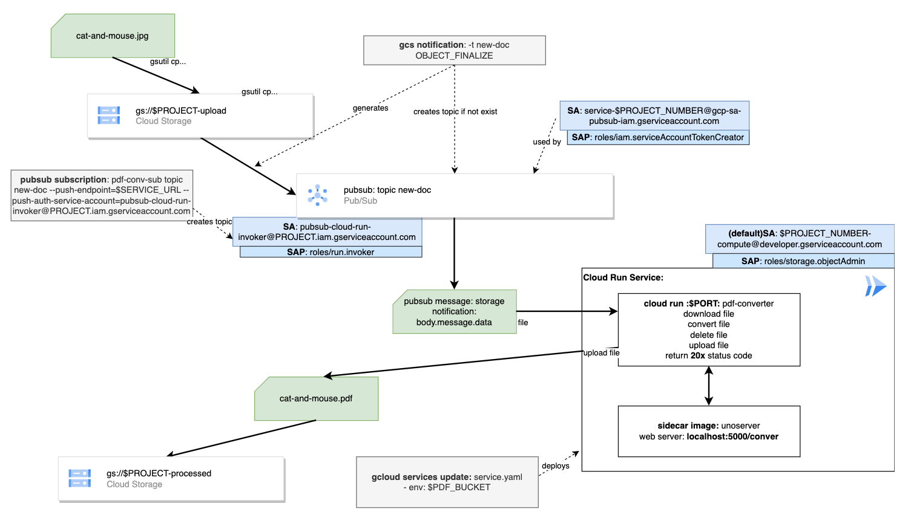

# Ballerina Cloud Run Service Study


This project is a study to create a Ballerina lang's drop-in replacement for a pdf-converter node.js application used as a Cloud Run service that implements file processing pipeline in an QwikLab [Creating a Streaming Data Pipeline for a Real-Time Dashboard with Dataflow](https://www.cloudskillsboost.google/focuses/8390?parent=catalog).

The instructions below correspont to the Task 3 and Task 4 of the Qwiklab. All the other lab tasks will run with no changes to achieve successful lab completion.

> __NOTE:__ To follow the lab's contents, you just need acess to the lab's instructions. You do not need to execute it. To see the instructions, you only need to be logged in into https://cloudskillsboost.google site.
> 
> The source code of the node.js application is located at https://github.com/rosera/pet-theory.git in the `pet-theory/lab03` folder.


## Requirements and Design

The processing pipeline starts with dropping a file to be converted to a pdf document into a `$PROJECT-upload` GCS bucket. 

The notification event is then generated and put into a pubsub queue `new-doc`. Pubsub does the authenticated request to the service URL. 

The service decodes base64 encoded message data value that contains the bucket name and file name to be processed. 

The service fetches the source file, processed it using an instance of LibreOffice in a headless mode into a pdf format. 

The generated pdf document is placed into the `$PROJECT-processed` storage bucket.



The pdf-converter service implementation features illustrated in this solution are:

* Ballerina: Google Cloud Storage connector
* Ballerina: Google ADC access token generation via Java SDK library
* Ballerina: Docker image creation
* GCP Cloud Run: Multi-container deployment
* GCP Cloud Run: Service listener configuration via $PORT env variable


## Install ballerina from a zip distribution file

A development machine prerequisites would include Ballerina installation, as well as gcloud and docker commands. 

As we are following QwikLabs script, the dev machine is our Cloud Shell instance. The docker and gcloud commands are already pre-installed. 

The steps to install a specific $BAL_VER distribution are:

```
export BAL_VER=2201.7.2

cd 

wget https://dist.ballerina.io/downloads/$BAL_VER/ballerina-$BAL_VER-swan-lake.zip

unzip ballerina-$BAL_VER-swan-lake.zip > bal-$BAL_VER-unzip.log 2>&1


# optionally: add to the .profile

printf "\nexport PATH=$PATH:~/ballerina-$BAL_VER-swan-lake/bin\n" >> ~/.profile

source ~/.profile

bal version
```


## Environment variables

If you do run the QwikLab, after you start the lab, make a note of a region where Cloud Run service is expected to be created. Edit the REGION variable respectively.

```
export PROJECT_ID=$GOOGLE_CLOUD_PROJECT

export REGION=us-west1

export PDF_CONVERTER_VER=0.2.0

export PDF_BUCKET=$PROJECT_ID-processed
````

## Build the pdf-converter docker image

?. Clone the source code

```
git clone https://...
```

?. Build the image and push it to the Cloud Container Registry

```
cd pdf-converter-bal-run

bal build --cloud="docker"

docker tag exco/pdf-converter:$PDF_CONVERTER_VER gcr.io/$PROJECT_ID/pdf-converter:$PDF_CONVERTER_VER

docker push gcr.io/$PROJECT_ID/pdf-converter:$PDF_CONVERTER_VER
```


## Cloud Run deploy service

There are a couple of variable that are deployment-dependant and we are using [envsubst](https://www.gnu.org/software/gettext/manual/html_node/envsubst-Invocation.html) Linux command to process the `service.yaml.tmpl` template file.

```
envsubst < service.yaml.tmpl > service.yaml
```

?. Deploy the Cloud Run service

```
gcloud run services replace service.yaml
```

?. After deployment finished successfully, fetch the service URL into the $SERVICE_URL env variable

```
SERVICE_URL=$(gcloud beta run services describe pdf-converter --platform managed --region Lab Region --format="value(status.url)")

echo $SERVICE_URL
```


### Incremental builds and semantic version/release management

If you want to experiment, change some code and re-deploy the service, use the following steps.


?. enable container registry api [ONE-OFF]


?. Increment environment variable version/release number

```
export PDF_CONVERTER_VER=0.2.1
```

> __NOTE:__ in automation scenario, use [dasel](https://github.com/TomWright/dasel) or equivalent to get and set the incremented release value of the build.
>
> This awk one-line will increment the last component of the semantic version:
> `NEXTVERSION=$(echo ${VERSION} | awk -F. -v OFS=. '{$NF += 1 ; print}')`

?. Update Cloud.toml's container.image.tag value


?. Regenerate  service.yaml file using envsubst from the template

?. Redeploy service gcloud service update.

---

TODO: add sections to generate and fix issues for google cloud storage connector and ADC access token java lib

---

## License

This material is copyright 2023 and is licensed under the Apache 2.0 license. See the [LICENSE](LICENSE) file